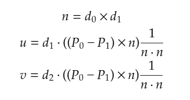

## closest point line line


## build

```
git submodule update --init
premake5 vs2019
```

## short answer 




```
	glm::vec3 n = glm::cross( d0, d1 );
	float length2n = glm::dot( n, n );
	glm::vec3 n2 = glm::cross( P0 - P1, n );
	float u = glm::dot( n2, d1 ) / length2n;
	float v = glm::dot( n2, d0 ) / length2n;

```

note: this doesn't include a corner case handling when d0 and d1 are perfectly parallel.

## deep explanation 
[derivation](derivation.pdf)

## references
Skew lines, https://en.m.wikipedia.org/wiki/Skew_lines#Nearest_Points

Cool Patches: A Geometric Approach to Ray/Bilinear Patch Intersections, https://research.nvidia.com/publication/2019-03_Cool-Patches%3A-A
> This article uses this technique - 8.4 line 31-40, 43-51 but they didn't explain how this approach works.